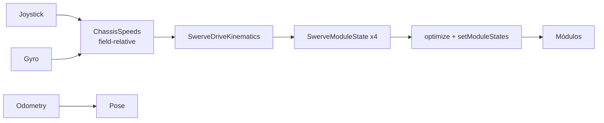
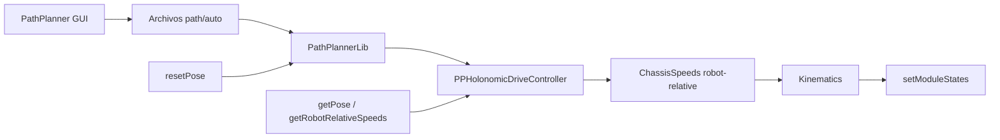
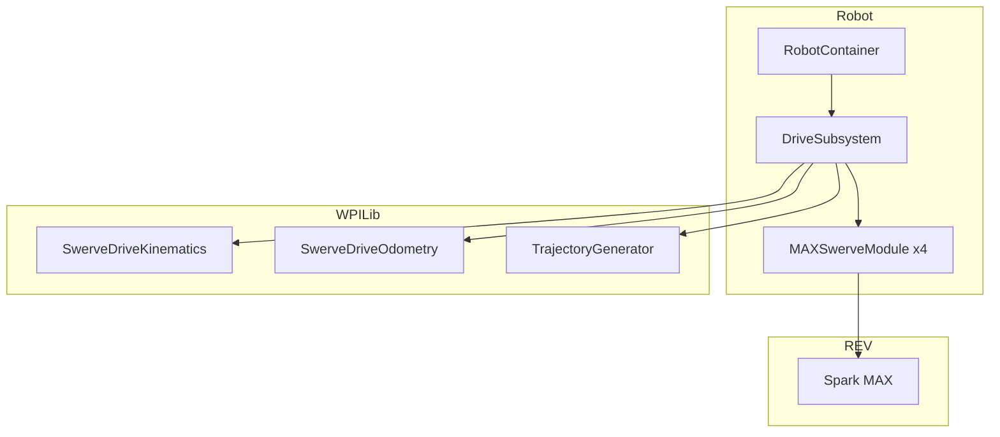

# Investigación FRC 2026 — Team 7717 Steam Punks

Documento de investigación: FRC, Swerve Drive, PathPlanner, Advantage Scope y análisis del código actual del robot.

---

## Tabla de contenidos

1. [Qué es FRC (FIRST Robotics Competition)](#1-qué-es-frc-first-robotics-competition)
2. [Cómo funciona un Swerve Drive en FRC](#2-cómo-funciona-un-swerve-drive-en-frc)
3. [PathPlanner](#3-pathplanner)
4. [Advantage Scope](#4-advantage-scope)
5. [Limelight](#5-limelight)
6. [Análisis del código actual (repositorio)](#6-análisis-del-código-actual-repositorio)
7. [Entregables: resúmenes, diagramas, enlaces y plan de trabajo](#7-entregables)

---

## 1. Qué es FRC (FIRST Robotics Competition)

### Definición y propósito

**FRC** es una competencia internacional de robótica para estudiantes de secundaria (grados 9–12, ~14–18 años). Los equipos diseñan, construyen y programan robots que juegan un juego de alianza contra otros equipos en un campo definido. La temporada incluye un lanzamiento de juego, un periodo de construcción (“build season”), regionals y campeonatos.

### Estructura de un partido (2026 — REBUILT)

- **Autonomous (15 s):** el robot opera sin control del driver (objetivos según manual de juego).
- **Teleoperated (~2 min):** los drivers controlan el robot.
- **Endgame:** tareas finales (ej. subir a una torre, según el juego).

Cada partido enfrenta dos alianzas (Roja vs Azul); cada alianza tiene varios robots. Se suman puntos por anotar, cruzar obstáculos, trepar, etc., según el manual de juego anual.

### Componentes de software y hardware típicos

| Área | Componentes |
|------|-------------|
| **Controlador** | RoboRIO (NI) — ejecuta el código del robot |
| **Controladores de motor** | SPARK MAX (REV), TalonFX (CTRE), etc. |
| **Motores** | NEO, NEO 550, Falcon 500 |
| **Sensores** | Gyro (ej. ADIS16470), encoders absolutos/relativos, limit switches |
| **Software** | WPILib (Java/C++/Python), Driver Station, vendor libs |
| **Comunicación** | CAN (motores/sensores), NetworkTables (telemetría) |

### Organización de la temporada

1. **Kickoff:** publicación del juego y manual.
2. **Build season:** ~6 semanas para diseñar y construir.
3. **Competencias:** regionals, district events, campeonatos.
4. **Sprints:** muchos equipos trabajan en sprints (diseño → prototipo → integración → tuning).

### Herramientas y lenguajes más usados

- **Lenguajes:** Java (muy común), C++, Python (RobotPy).
- **Framework:** WPILib (control, kinematics, comandos, etc.).
- **IDEs:** VS Code con extensiones WPILib.
- **Build:** Gradle (GradleRIO).
- **Path planning:** PathPlanner, PathWeaver (legacy).
- **Diagnóstico/logs:** Advantage Scope, AdvantageKit, Data Logs de WPILib.

### Desafíos típicos de control y autonomía

- **Odometría:** estimar pose (x, y, θ) con precisión (encoders + gyro, y opcionalmente visión).
- **Seguimiento de trayectorias:** que el robot siga paths sin desviarse ni girar de más.
- **Control de ángulo en swerve:** que cada módulo apunte al ángulo correcto con poco overshoot.
- **Integración teleop/auto:** transiciones suaves y sin conflictos de comandos.
- **Robustez:** manejo de deriva del gyro, ruedas que patinan, cambios de batería.

---

## 2. Cómo funciona un Swerve Drive en FRC

### Qué es y para qué sirve

Un **swerve drive** es una base con **módulos independientes**: cada rueda puede **girar su dirección** (azimuth) y **avanzar/retroceder** (drive). Así el robot puede:

- Moverse en **cualquier dirección** sin girar el chasis (holonómico).
- **Rotar** sobre su eje mientras se desplaza.
- Combinar traslación y rotación de forma fluida.

En FRC se usa para autonomía precisa, evasión rápida y control fino en teleop.

### Principios de movimiento

- **Cinemática inversa:** dado (vx, vy, ω) del chasis → se calcula velocidad y ángulo de cada módulo.
- **Cinemática directa:** dados los estados de los módulos → se calcula (vx, vy, ω) del chasis (útil para odometría).
- **Optimización de ángulo:** para cada módulo se elige el ángulo que minimiza el giro (ej. ir de 350° a 10° pasando por 0°).
- **Desaturación:** si algún módulo supera la velocidad máxima, se escalan todos para mantener la dirección.

### Modelado matemático (WPILib)

- **ChassisSpeeds:** (vx, vy, ω) en m/s y rad/s.
- **SwerveModuleState:** (speedMetersPerSecond, angle) por módulo.
- **SwerveDriveKinematics:** construido con las posiciones de cada módulo respecto al centro del robot (`Translation2d`). Con eso:
  - `toSwerveModuleStates(ChassisSpeeds)` → array de `SwerveModuleState`.
  - `toChassisSpeeds(SwerveModuleState...)` → `ChassisSpeeds`.
- **Field-relative:** `ChassisSpeeds.fromFieldRelativeSpeeds(vx, vy, omega, robotRotation)` para que “adelante” sea siempre respecto al campo.

### Ventajas y desventajas vs otros sistemas

| | Swerve | Tank | Mecanum |
|--|--------|------|--------|
| **Omnidireccional** | Sí | No | Sí (con deslizamiento) |
| **Precisión de ángulo** | Muy alta | Baja | Media |
| **Complejidad** | Alta (mecánica + control) | Baja | Media |
| **Peso/costo** | Mayor | Menor | Medio |
| **Mantenimiento** | Encoders absolutos, más partes | Menor | Medio |

### Integración con WPILib

- **SwerveDriveKinematics:** conversión chassis ↔ módulos.
- **SwerveDriveOdometry:** actualización de la pose (gyro + posiciones de módulos).
- **SwerveControllerCommand:** sigue una trayectoria WPILib (trajectory + PID x, y, θ) y llama a `setModuleStates`.

### Módulos típicos (ej. REV MAXSwerve)

- **Drive:** motor (NEO) + reductora + rueda; encoder relativo para velocidad/posición.
- **Turning/Azimuth:** motor (NEO 550) + encoder **absoluto** (Through Bore) para ángulo; PID en el SPARK MAX.
- **Offsets:** cada módulo tiene un offset angular respecto al chasis (calibración).

En nuestro código usamos **MAXSwerve** (REV): 4 módulos, NEO drive, NEO 550 turning, SPARK MAX, encoder absoluto REV Through Bore.

---

## 3. PathPlanner

### Qué es

**PathPlanner** es un generador de trayectorias y autónomos para FRC (Team 3015). Incluye:

- **App PathPlanner (GUI):** dibujar paths con curvas de Bézier, configurar robot, eventos, autos.
- **PathPlannerLib:** librería en el robot para seguir paths y construir autónomos desde archivos generados en la GUI.

### Para qué sirve y cómo mejora la autonomía

- Paths suaves y editables (Bézier).
- Modo **holonómico:** la rotación del robot puede desacoplarse de la dirección de avance.
- **Event markers:** ejecutar comandos en puntos del path (intake, shooter, etc.).
- **Pathfinding:** generación de rutas de A→B evitando obstáculos (PathPlannerLib).
- **Hot reload:** actualizar paths/autos en el robot sin redesplegar código.
- Autos modulares componiendo varios paths.

### Configuración con swerve

En la GUI se configura:

- **Robot Config:** masa, MOI, track width (differential) o **module offsets** (swerve), wheel radius, gearing, max speed, etc.
- **Paths:** waypoints y restricciones.
- **Autos:** secuencia de paths + eventos.

En código (PathPlannerLib) se configura **AutoBuilder** una vez (típicamente en el constructor del DriveSubsystem):

- `getPose`, `resetPose`, `getRobotRelativeSpeeds`, método que recibe `ChassisSpeeds` (robot-relative) y comanda el drive.
- Controlador holonómico (ej. `PPHolonomicDriveController` con PID de traslación y rotación).
- **RobotConfig** desde la GUI: `RobotConfig.fromGUISettings()`.
- Supplier “should flip path” para alianza Roja (espejar path).

Importante: PathPlanner trabaja con **ChassisSpeeds robot-relative**; nuestro `DriveSubsystem` hoy recibe field-relative en teleop, así que para PathPlanner hace falta un método que acepte robot-relative y convierta a módulos (o reutilizar la misma conversión con ChassisSpeeds ya en marco robot).

### Ejemplo práctico (resumen)

```java
// En DriveSubsystem, después de crear kinematics, odometry, etc.:
RobotConfig config = RobotConfig.fromGUISettings();
AutoBuilder.configure(
    this::getPose,
    this::resetOdometry,  // resetPose
    this::getRobotRelativeSpeeds,
    (speeds, ff) -> driveRobotRelative(speeds),
    new PPHolonomicDriveController(
        new PIDConstants(5.0, 0, 0),
        new PIDConstants(5.0, 0, 0)
    ),
    config,
    () -> DriverStation.getAlliance().orElse(Blue) == Red,
    this
);

// En RobotContainer:
autoChooser = AutoBuilder.buildAutoChooser();
SmartDashboard.putData("Auto Chooser", autoChooser);
// getAutonomousCommand(): return autoChooser.getSelected();
```

### Generar, simular y seguir trayectorias

1. **Generar:** En la app PathPlanner, configurar robot (incl. módulos para swerve), dibujar path, guardar. Crear “Auto” que use uno o más paths.
2. **Desplegar:** Los archivos se copian al RoboRIO (deploy/pathplanner/...) con el deploy del proyecto.
3. **Seguir:** PathPlannerLib lee esos archivos; `PathPlannerAuto("NombreAuto")` construye el comando que sigue los paths y ejecuta eventos.

La simulación se hace en WPILib Sim (o similar) con el mismo código; PathPlanner no incluye simulador propio pero los paths se pueden ver en la GUI.

---

## 4. Advantage Scope

### Qué es

**Advantage Scope** es una aplicación de diagnóstico y análisis de logs para FRC (Team 6328). Lee logs (WPILOG, DS log, REV, CTRE, CSV, etc.) y puede ver datos en vivo vía NetworkTables (NT4), Phoenix, RLOG, etc. Funciona con cualquier proyecto WPILib; **no requiere AdvantageKit**, pero AdvantageKit está optimizado para usarlo.

### Qué ofrece

- Gráficas y tablas de series temporales.
- Visualización 2D/3D del campo con poses y opcionalmente CAD del robot.
- **Tab Swerve:** vectores de velocidad por módulo, ChassisSpeeds, rotación del robot.
- Sincronización con video del partido.
- Visualización de joysticks.
- Mensajes de consola, estadísticas de log, export (CSV, WPILOG).

### Integración con nuestro código (Swerve)

Para ver el estado de los módulos en Advantage Scope hay que **publicar** los `SwerveModuleState[]` (y opcionalmente ChassisSpeeds, Rotation2d). Ejemplo con **NetworkTables** (WPILib):

```java
// En el subsistema de drive, como publisher:
StructArrayPublisher<SwerveModuleState> swerveStatesPublisher =
    NetworkTableInstance.getDefault()
        .getStructArrayTopic("/SwerveStates", SwerveModuleState.struct)
        .publish();

// En periodic():
swerveStatesPublisher.set(new SwerveModuleState[] {
    m_frontLeft.getState(),
    m_frontRight.getState(),
    m_rearLeft.getState(),
    m_rearRight.getState()
});
```

En Advantage Scope se añade una fuente “Module States” apuntando a ese topic (ej. `/SwerveStates`). Así se revisan trayectorias, patinaje y comportamiento de cada módulo en teleop y auto.

### Casos de uso

- Revisar si los módulos siguen bien los setpoints en auto.
- Detectar deslizamiento o saturaciones.
- Comparar pose estimada vs video del partido.
- Ajustar PID y límites de velocidad con datos reales.

---

## 5. Limelight

### Qué es

**Limelight** es una cámara de visión para FRC que corre pipelines de procesamiento de imagen **en la cámara** (onboard). Envía resultados al RoboRIO por **NetworkTables**, así que el código del robot solo lee datos ya procesados (ángulos al objetivo, pose estimada, etc.) sin cargar la CPU del RoboRIO. Es muy usada para apuntar a objetivos (retroreflectores, AprilTags) y para **localización en el campo** (pose estimation).

### Para qué sirve en FRC

- **Targeting:** obtener desviación horizontal/vertical (tx, ty) hacia un objetivo para que el robot apunte (ej. torreta, disparador, alineación para anotar).
- **Pose estimation:** con AprilTags (y pipelines MegaTag/MegaTag2), estimar la pose del robot (x, y, θ) en el campo y fusionarla con odometría (encoder + gyro) para mayor precisión.
- **Detección de piezas de juego:** pipelines por color o redes neuronales (más lentas, ~10 fps) para detectar game pieces.
- **Ventaja:** procesamiento en la cámara (hasta ~90 fps en pipelines por color), baja latencia y fácil integración vía NetworkTables o LimelightHelpers.

### Componentes y flujo

1. **Cámara Limelight:** conectada por Ethernet a la red del robot; IP típica o nombre `limelight.local`.
2. **Web interface:** `http://limelight.local:5801` — configurar resolución (ej. 320×240 @ 90 fps), exposición, y **pipelines** (hasta 10).
3. **Pipelines:** cada pipeline define qué detectar (retroreflector, AprilTag, color, etc.). Se cambia por código con `setPipelineIndex()`.
4. **Salida:** el robot lee por NetworkTables (o con **LimelightHelpers**) valores como `tx`, `ty`, `ta`, `tv`, o pose completa (`getBotPose2d`, `getBotPoseEstimate_wpiBlue_MegaTag2`, etc.).

### API típica (LimelightHelpers — Java)

La librería oficial para WPILib es **LimelightLib** (Java/C++). En Java suele usarse un archivo `LimelightHelpers.java`; no hace falta instanciar objetos, todo son llamadas estáticas con el nombre de la cámara (string, `""` para la Limelight por defecto).

**Targeting (retroreflector / objetivo simple):**

| Método | Descripción |
|--------|-------------|
| `getTX("")` | Desviación horizontal al objetivo (grados). |
| `getTY("")` | Desviación vertical (grados). |
| `getTA("")` | Área del objetivo (0–100% de la imagen). |
| `getTV("")` | ¿Hay objetivo válido? (boolean). |

**Control de cámara:**

| Método | Descripción |
|--------|-------------|
| `setPipelineIndex("", 0)` | Cambiar pipeline (0–9). |
| `setLEDMode_ForceOn("")` | LEDs encendidos. |
| `setLEDMode_ForceOff("")` | LEDs apagados. |
| `setLEDMode_PipelineControl("")` | Que el pipeline actual controle los LEDs. |

**Pose estimation (AprilTag / MegaTag):**

- **MegaTag2 (recomendado 2024+):** usar `getBotPoseEstimate_wpiBlue_MegaTag2("")` y enviar cada frame la orientación del gyro con `SetRobotOrientation("", headingDegrees, ...)` para mejor precisión.
- El resultado es un `PoseEstimate` (pose, timestamp, tagCount) que se puede pasar a un **pose estimator** de WPILib (`addVisionMeasurement`) para fusionar con odometría de drive.

### Integración con WPILib y con nuestro código

- **Solo targeting:** leer `getTX()`/`getTY()` en un comando o subsistema y usar un PID que genere rotación (y opcionalmente avance) para alinear el robot.
- **Pose estimation:** mantener un `SwerveDrivePoseEstimator` (o similar) que en `periodic()` actualice con odometría de encoders + gyro y, cuando Limelight vea AprilTags, llame a `addVisionMeasurement(pose, timestamp)` con la pose y timestamp de Limelight. Así la pose del robot (y la que usa PathPlanner o el auto) se corrige con visión.

En nuestro repositorio **no hay aún Limelight**: no está la dependencia LimelightHelpers ni ningún subsistema/comando de visión. Si se añade, conviene un subsistema `VisionSubsystem` (o integrado en drive) que lea Limelight y opcionalmente actualice el pose estimator.

### Documentación y recursos

- Documentación general: [docs.limelightvision.io](https://docs.limelightvision.io/)
- Limelight Lib (Java): [FRC Programming with Limelight Lib](https://docs.limelightvision.io/docs/docs-limelight/apis/limelight-lib) — instalación (copiar `LimelightHelpers.java`) y API.
- Pipelines FRC: [FRC Pipeline Setup](https://docs.limelightvision.io/docs/docs-limelight/getting-started/FRC/pipelines).
- Localización con AprilTag/MegaTag: [Robot Localization with MegaTag](https://docs.limelightvision.io/docs/docs-limelight/pipeline-apriltag/apriltag-robot-localization), [MegaTag2](https://docs.limelightvision.io/docs/docs-limelight/pipeline-apriltag/apriltag-robot-localization-megatag2).
- Repo Java: [LimelightVision/limelightlib-wpijava](https://github.com/LimelightVision/limelightlib-wpijava).

### Ejemplo mínimo (targeting con PID de rotación)

```java
// En un comando o periodic del subsistema que comanda el drive:
double tx = LimelightHelpers.getTX("");
double tv = LimelightHelpers.getTV("");
if (tv) {
    double rot = -tx * 0.05;  // P simple: girar para reducir tx
    m_robotDrive.drive(0, 0, rot, true);  // solo rotar
} else {
    m_robotDrive.drive(0, 0, 0, true);     // no hay objetivo
}
```

### Ejemplo (visión en pose estimator con MegaTag2)

```java
// En el subsistema de drive, si usas SwerveDrivePoseEstimator:
LimelightHelpers.SetRobotOrientation("limelight",
    getHeading(), 0, 0, 0, 0, 0);
LimelightHelpers.PoseEstimate mt2 =
    LimelightHelpers.getBotPoseEstimate_wpiBlue_MegaTag2("limelight");
if (mt2.tagCount > 0) {
    m_poseEstimator.addVisionMeasurement(mt2.pose, mt2.timestampSeconds);
}
```

---

## 6. Análisis del código actual (repositorio)

### Arquitectura general

- **Estilo:** Command-based (WPILib), un subsistema de drive (swerve), sin otros subsistemas aún.
- **Entrada:** `Main` → `Robot` → `RobotContainer`; `RobotContainer` crea subsistemas, bindings y el comando autónomo.
- **Drive:** `DriveSubsystem` + 4× `MAXSwerveModule`; odometría con `SwerveDriveOdometry` y gyro ADIS16470.

### Estructura de archivos

```
src/main/java/frc/robot/
├── Main.java              → arranque
├── Robot.java             → TimedRobot, scheduler, init auto/teleop
├── RobotContainer.java    → DriveSubsystem, XboxController, bindings, getAutonomousCommand()
├── Constants.java         → Drive, Module, OI, Auto, Neo
├── Configs.java           → configuraciones Spark MAX (drive/turn) para MAXSwerve
└── subsystems/
    ├── DriveSubsystem.java   → 4 módulos, gyro, odometry, drive(), setX(), setModuleStates()
    └── MAXSwerveModule.java  → 2 Spark MAX, encoder relativo + absoluto, setDesiredState/optimize
```

### Patrones y frameworks

- **WPILib:** TimedRobot, CommandScheduler, SubsystemBase, RunCommand, InstantCommand, SwerveControllerCommand.
- **REV (REVLib):** SparkMax, configuración vía `Configs` (SparkMaxConfig, AbsoluteEncoderConfig), control en velocidad (drive) y posición (turning).
- **Constantes:** todo en `Constants` (IDs CAN, geometría, PID, deadband).
- **Kinematics:** `SwerveDriveKinematics` con 4 `Translation2d` (wheelbase 26.5", trackwidth 26.5").
- **Autonomous:** una trayectoria de ejemplo con `TrajectoryGenerator` y `SwerveControllerCommand` (sin PathPlanner).

### Qué está implementado

| Componente | Estado |
|------------|--------|
| Swerve 4 módulos (MAXSwerve) | ✅ |
| Kinematics y desaturación | ✅ |
| Odometría (gyro + posiciones módulos) | ✅ |
| Drive field-relative (teleop) | ✅ |
| setX (ruedas en X) | ✅ |
| Zero heading (Start) | ✅ |
| Auto de ejemplo (path en código) | ✅ |
| Configuración REV (drive/turn, encoder absoluto) | ✅ |

### Qué falta o conviene mejorar

| Tema | Detalle |
|------|--------|
| **PathPlanner** | No está integrado: no hay PathPlannerLib en `build.gradle`, ni AutoBuilder, ni `RobotConfig`, ni método `driveRobotRelative`/`getRobotRelativeSpeeds`. |
| **Advantage Scope** | No se publican `SwerveModuleState[]` (ni ChassisSpeeds) a NetworkTables; no hay telemetría para la pestaña Swerve. |
| **Autonomous** | Un solo auto fijo (path generado en código); no hay chooser ni autos por nombre; no hay eventos ni pathfinding. |
| **getRobotRelativeSpeeds** | No existe; necesario para PathPlanner. Se puede implementar con `kDriveKinematics.toChassisSpeeds(moduleStates)`. |
| **driveRobotRelative** | No existe; actualmente solo `drive(x, y, rot, fieldRelative)`. Hay que añadir un método que tome `ChassisSpeeds` (robot-relative) y aplique kinematics + setModuleStates. |
| **README vs código** | README menciona Arcade/Tank, Intake, Shooter, Elevator; el código solo tiene Drive (swerve). Actualizar README evita confusión. |
| **Deploy pathplanner** | Si se usa PathPlanner, asegurar que los JSON de paths/autos se desplieguen (por defecto suele ir en `deploy/pathplanner`). |

### Resumen de completitud

- **Completo:** base swerve, teleop, odometría, auto básico WPILib, configuración REV.
- **Refactor/documentación:** README alineado con la arquitectura real; comentar offsets y IDs CAN para quien mantenga el robot.
- **Falta principal:** PathPlanner (AutoBuilder + drive robot-relative), telemetría para Advantage Scope, y ampliación de autónomos (chooser, múltiples rutinas).
- **Limelight:** no está en el proyecto (ni LimelightHelpers ni subsistema de visión); se puede añadir más adelante para targeting o pose estimation con AprilTags.

---

## 7. Entregables

### Resumen por tópico

- **FRC:** Competencia por equipos con robots en campo; partidos auto + teleop; stack WPILib + RoboRIO + CAN; temporada por juego anual; desafíos típicos en odometría, path following y robustez.
- **Swerve:** Base holonómica con módulos (ángulo + velocidad); cinemática inversa/directa en WPILib; field-relative; optimización de ángulo y desaturación; nuestro robot = 4× MAXSwerve con NEO/550 y SPARK MAX.
- **PathPlanner:** GUI para paths y autos; PathPlannerLib con AutoBuilder y PPHolonomicDriveController; requiere getPose, resetPose, getRobotRelativeSpeeds, driveRobotRelative y RobotConfig; mejora autonomía con paths editables, eventos y pathfinding.
- **Advantage Scope:** Herramienta de análisis de logs y vista en vivo; tab Swerve con Module States/ChassisSpeeds; se alimenta publicando `SwerveModuleState[]` (y opcionalmente ChassisSpeeds) por NetworkTables o con AdvantageKit.
- **Limelight:** Cámara de visión con procesamiento onboard; targeting (tx, ty, ta, tv) y pose estimation con AprilTag/MegaTag2; se integra por NetworkTables o LimelightHelpers; útil para alineación y para fusionar visión con odometría (SwerveDrivePoseEstimator).

### Diagramas conceptuales

#### Flujo de control Swerve (teleop)



#### Flujo PathPlanner (auto)



#### Ubicación de nuestro código en el stack



### Documentación oficial relevante (enlaces)

| Recurso | URL |
|--------|-----|
| FRC 2026 Game Manual / Season | https://www.firstinspires.org/resources/library/frc/season-materials |
| WPILib Docs (stable) | https://docs.wpilib.org |
| Swerve Drive Kinematics (WPILib) | https://docs.wpilib.org/en/stable/docs/software/kinematics-and-odometry/swerve-drive-kinematics.html |
| PathPlanner Home | https://pathplanner.dev/home.html |
| PathPlanner Getting Started | https://pathplanner.dev/pplib-getting-started.html |
| PathPlanner Build an Auto | https://pathplanner.dev/pplib-build-an-auto.html |
| PathPlanner Robot Config | https://pathplanner.dev/robot-config.html |
| PathPlannerLib JSON (vendor) | https://3015rangerrobotics.github.io/pathplannerlib/PathplannerLib.json |
| Advantage Scope | https://docs.advantagescope.org/ |
| Advantage Scope Swerve tab | https://docs.advantagescope.org/tab-reference/swerve/ |
| Limelight Docs | https://docs.limelightvision.io/ |
| Limelight Lib (Java/C++) | https://docs.limelightvision.io/docs/docs-limelight/apis/limelight-lib |
| Limelight FRC Pipelines | https://docs.limelightvision.io/docs/docs-limelight/getting-started/FRC/pipelines |
| Limelight MegaTag2 localization | https://docs.limelightvision.io/docs/docs-limelight/pipeline-apriltag/apriltag-robot-localization-megatag2 |
| LimelightHelpers Java (GitHub) | https://github.com/LimelightVision/limelightlib-wpijava |
| REV MAXSwerve | https://docs.revrobotics.com/ion-build/motion/maxswerve |
| REV Spark MAX | https://docs.revrobotics.com/brushless/spark-max/ |

### Ejemplos de código clave

#### 1) ChassisSpeeds robot-relative y drive robot-relative (para PathPlanner)

En `DriveSubsystem`:

```java
/** ChassisSpeeds en marco robot (para PathPlanner / seguimiento de path). */
public ChassisSpeeds getRobotRelativeSpeeds() {
    return DriveConstants.kDriveKinematics.toChassisSpeeds(
        m_frontLeft.getState(),
        m_frontRight.getState(),
        m_rearLeft.getState(),
        m_rearRight.getState()
    );
}

/** Comanda el drive con ChassisSpeeds en marco robot. */
public void driveRobotRelative(ChassisSpeeds speeds) {
    var states = DriveConstants.kDriveKinematics.toSwerveModuleStates(speeds);
    SwerveDriveKinematics.desaturateWheelSpeeds(states, DriveConstants.kMaxSpeedMetersPerSecond);
    setModuleStates(states);
}
```

#### 2) Publicar SwerveModuleState[] para Advantage Scope

En `DriveSubsystem` (campos y constructor):

```java
import edu.wpi.first.networktables.StructArrayPublisher;
import edu.wpi.first.networktables.NetworkTableInstance;

private final StructArrayPublisher<SwerveModuleState> swerveStatesPublisher =
    NetworkTableInstance.getDefault()
        .getStructArrayTopic("/SwerveStates", SwerveModuleState.struct)
        .publish();
```

En `periodic()`:

```java
swerveStatesPublisher.set(new SwerveModuleState[] {
    m_frontLeft.getState(),
    m_frontRight.getState(),
    m_rearLeft.getState(),
    m_rearRight.getState()
});
```

#### 3) Configurar PathPlanner AutoBuilder (esqueleto en DriveSubsystem)

Requiere añadir dependencia PathPlannerLib (vendor dep) y en el constructor del drive, después de inicializar todo:

```java
// PathPlanner: cargar config y configurar AutoBuilder (una sola vez)
try {
    RobotConfig config = RobotConfig.fromGUISettings();
    AutoBuilder.configure(
        this::getPose,
        this::resetOdometry,
        this::getRobotRelativeSpeeds,
        (speeds, ff) -> driveRobotRelative(speeds),
        new PPHolonomicDriveController(
            new PIDConstants(5.0, 0, 0),
            new PIDConstants(5.0, 0, 0)
        ),
        config,
        () -> DriverStation.getAlliance().isPresent()
            && DriverStation.getAlliance().get() == DriverStation.Alliance.Red,
        this
    );
} catch (Exception e) {
    // config no encontrado o error: no usar PathPlanner
}
```

Luego en `RobotContainer`: `autoChooser = AutoBuilder.buildAutoChooser();` y en `getAutonomousCommand()` devolver `autoChooser.getSelected()` (o un auto por defecto si no se usa chooser).

---

### Plan de trabajo sugerido (priorizado)

| # | Tarea | Prioridad | Dependencias |
|---|--------|------------|--------------|
| 1 | Implementar `getRobotRelativeSpeeds()` y `driveRobotRelative(ChassisSpeeds)` en `DriveSubsystem` | Alta | Ninguna |
| 2 | Añadir PathPlannerLib (vendor dependency) y configurar AutoBuilder en `DriveSubsystem` | Alta | 1 |
| 3 | Configurar Robot en PathPlanner GUI (módulos, max speed, etc.) y crear al menos un path de prueba | Alta | 2 |
| 4 | En `RobotContainer`: Auto Chooser con PathPlanner (o `PathPlannerAuto("Nombre")`) y desplegar paths/autos | Alta | 2, 3 |
| 5 | Publicar `SwerveModuleState[]` en NetworkTables para Advantage Scope | Media | Ninguna |
| 6 | Probar en simulación y en robot real: teleop + auto PathPlanner; ajustar PID de path following | Alta | 1–4 |
| 7 | Actualizar README: reflejar solo Drive swerve, eliminar referencias a subsistemas no implementados; documentar controles y estructura | Baja | Ninguna |
| 8 | (Opcional) AdvantageKit para logging avanzado y replay | Baja | 5 |
| 9 | (Futuro) Nuevos subsistemas (intake, shooter, etc.) y eventos de PathPlanner en autos | Media | 4 |
| 10 | (Opcional) Limelight: añadir LimelightHelpers, subsistema/comando de targeting (tx/ty → PID rotación) o pose estimation con MegaTag2 + SwerveDrivePoseEstimator | Media | Drive con getPose/resetOdometry |

Orden sugerido de implementación: **1 → 5 (en paralelo con 2) → 2 → 3 → 4 → 6 → 7**. Limelight (10) puede hacerse en paralelo cuando haya hardware y necesidad de visión.

---

### Hoja de ruta de dominio del tema

Para enseñar, replicar o evaluar el dominio de FRC y swerve en el equipo:

1. **Conceptos (explicar en 5 min):** qué es FRC, qué es un swerve, por qué usamos ChassisSpeeds y SwerveModuleState, qué hace la kinematics y la odometría.
2. **Código (mostrar en 10 min):** dónde se calculan los module states en nuestro repo, dónde se actualiza la odometría, qué es field-relative vs robot-relative.
3. **PathPlanner (práctica):** configurar robot en la GUI, crear un path, añadir AutoBuilder en código, ejecutar un auto y ver el robot seguir la ruta.
4. **Diagnóstico (práctica):** grabar un log o conectar Advantage Scope en vivo, abrir la pestaña Swerve y relacionar vectores con el movimiento del robot.
5. **Evaluación:** que un miembro implemente `getRobotRelativeSpeeds` y `driveRobotRelative` solo con la doc de WPILib; que otro integre PathPlanner siguiendo la guía de pathplanner.dev.

---

*Documento generado como parte de la investigación para el proyecto FRC 7717 2026. Última actualización: Febrero 2026.*
